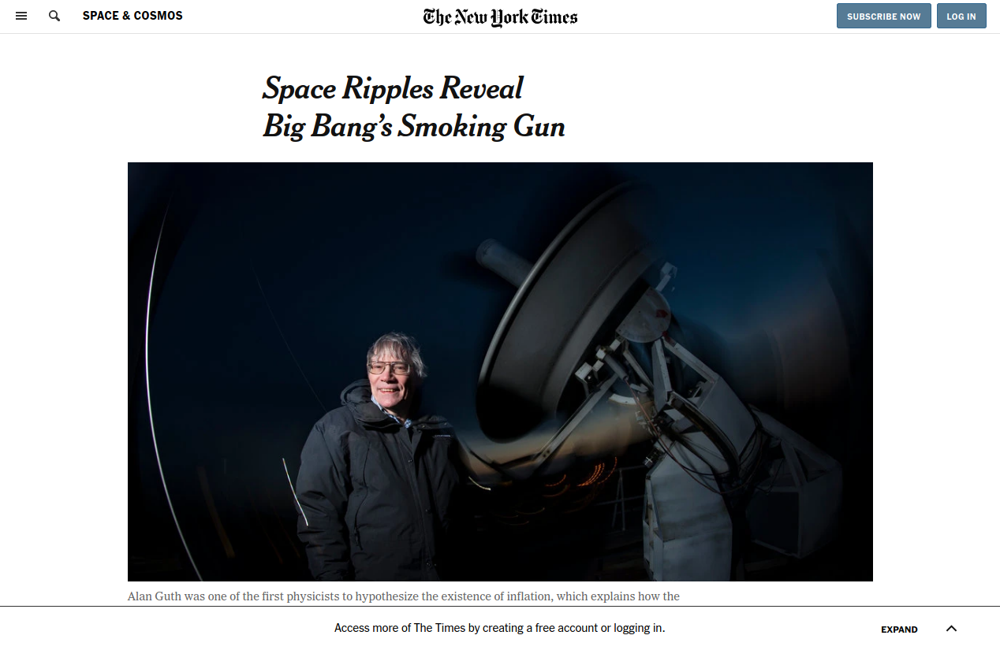

# New-York-Times-Clone

> A clone of [New York Times Page](https://www.nytimes.com/2014/03/18/science/space/detection-of-waves-in-space-buttresses-landmark-theory-of-big-bang.html?_r=0)

Project: Positioning and Floating Elements.

## Built With

- HTML5,
- CSS3,
- Float Positioning

## Live Demo

[Live Demo Link](https://raw.githack.com/mariancristu/New-York-Times-Clone/feature-navbar/index.html)

## Getting Started

**Use browser of choise**

## Authors

👤 **Ivan Ulises Guzmán Sanchez**

- Github: [@githubhandle](https://github.com/fivan18)
- Twitter: [@twitterhandle](https://twitter.com/twitterhandle)
- Linkedin: [linkedin](https://linkedin.com/linkedinhandle)

👤 **Cristu Marian**

- Github: [@githubhandle](https://github.com/mariancristu)
- Twitter: [@twitterhandle](https://twitter.com/marian_cristu)
- Linkedin: [linkedin](https://www.linkedin.com/in/marian-cristu-b687b3197)

## 🤝 Contributing

Contributions, issues and feature requests are welcome!

Feel free to check the [issues page](https://github.com/mariancristu/New-York-Times-Clone/issues).

## Show your support

Give a ⭐️ if you like this project!
